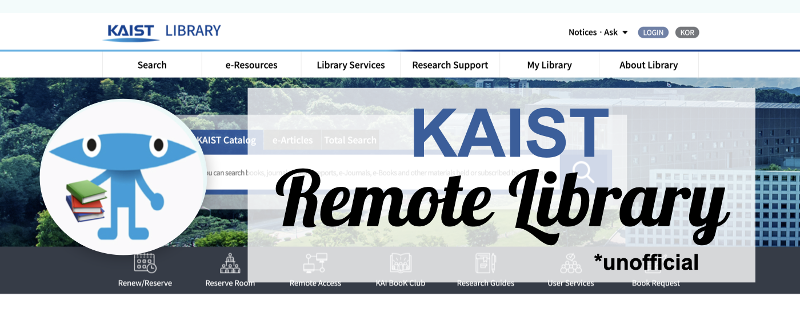

# KAIST Remote Library Chrome Extension

Chrome extension providing off-campus access to e-resources (e-journals, e-books, web DBs) for members of KAIST (https://library.kaist.ac.kr) via library proxy. The extension is for KAIST members only (requires authentication).

## How to use it

Once installed, visit a page like the [ACM Digital Library](https://dl.acm.org) or [IEEE Xplore](https://ieeexplore.ieee.org). If the website asks for institutional login, click the extension icon button, and you will be redirected to the same page as if you were on the KAIST campus.

## How to install the extension

### Option 1

Head to the Chrome Store and search for KAIST Remote Library. Install it from there.

### Option 2

- [Download](https://github.com/makelab-kaist/KAIST-Remote-Library-Chrome-Extension/archive/refs/heads/main.zip) the code for this extension and unzip it.
- Open Chrome or an equivalent browser that supports Chrome Extensions.
- Go to the extensions page: `chrome://extensions`.
- Ensure that the `Developer mode` is active (top right corner).
- Click on the `Load Unpacked` button and select the folder **KAIST-Remote-Library-Chrome-Extension**.
- Make sure that the extension is enabled. You can also pin it to the toolbar (see the `Details` panel).
- The extension is ready for usage.

## License

MIT
